<

<!-- 📊 GitHub Repository Stats -->
[](https://github.com/tannu27data/Neuro-Behavior-Clinical-Health-Risk-Analytics/stargazers)
[](https://github.com/tannu27data/Neuro-Behavior-Clinical-Health-Risk-Analytics/network/members)
[](https://github.com/tannu27data/Neuro-Behavior-Clinical-Health-Risk-Analytics/watchers)
[](https://github.com/tannu27data/Neuro-Behavior-Clinical-Health-Risk-Analytics/commits)
[](https://github.com/tannu27data/Neuro-Behavior-Clinical-Health-Risk-Analytics)

<!-- 🛠️ Tech Stack Badges -->
[](https://www.python.org/)
[](https://jupyter.org/)
[](https://pandas.pydata.org/)
[](https://scikit-learn.org/)
[](https://xgboost.readthedocs.io/)
[](https://lightgbm.readthedocs.io/)
[](https://shap.readthedocs.io/)
[](LICENSE)

<br/>

*Transforming raw clinical data into actionable intelligence — supporting preventive healthcare and personalized medicine through advanced data analytics, statistical rigor, and machine learning.*

---

**Author:** [Tannu Shree](https://github.com/tannu27data)  
**Repository:** [Neuro-Behavior-Clinical-Health-Risk-Analytics](https://github.com/tannu27data/Neuro-Behavior-Clinical-Health-Risk-Analytics)

---

</div>

## 🌟 Executive Summary & Project Highlights

Welcome to the **Neuro-Behavior Clinical Health Risk Analytics** project. This repository hosts a massive, production-grade data science pipeline that bridges the gap between behavioral science, clinical diagnostics, and artificial intelligence. By integrating lifestyle factors (like sleep duration and psychological stress) with deep physiological markers (like lipid panels and liver enzymes), this project predicts patient health risk levels and provides deep, explainable insights into the exact mathematical and biological *why* behind those predictions.

Traditional medical models often suffer from a reductionist approach, viewing physical ailments entirely separately from psychological and behavioral states. This project mathematically challenges that paradigm. Through a grueling **40-section analytical framework**, we demonstrate that human health is a complex, interconnected biological network.

<table>
<tr>
<td width="25%" align="center"><b>📊 98+</b><br/>Production-Quality<br/>Visualizations</td>
<td width="25%" align="center"><b>🤖 8</b><br/>ML Classification<br/>Models</td>
<td width="25%" align="center"><b>🧬 8</b><br/>Engineered Clinical<br/>Indices</td>
<td width="25%" align="center"><b>📋 40</b><br/>Analytical<br/>Sections</td>
</tr>
<tr>
<td width="25%" align="center"><b>🔬 6</b><br/>Statistical<br/>Hypothesis Tests</td>
<td width="25%" align="center"><b>👥 1,000</b><br/>Patient<br/>Records</td>
<td width="25%" align="center"><b>📐 24</b><br/>Clinical &amp; Behavioral<br/>Features</td>
<td width="25%" align="center"><b>🎯 SHAP</b><br/>Explainable AI<br/>Integration</td>
</tr>
</table>

---

## 📋 Comprehensive Table of Contents

1. [🔍 Project Scope & Scientific Objectives](#-project-scope--scientific-objectives)
2. [🗺️ System Architecture & Clinical Pathway](#️-system-architecture--clinical-pathway)
3. [📊 Exhaustive Dataset Architecture & Data Dictionary](#-exhaustive-dataset-architecture--data-dictionary)
4. [🧹 Data Quality Assurance & Mathematical Preprocessing](#-data-quality-assurance--mathematical-preprocessing)
5. [📈 Advanced Exploratory Data Analysis (EDA) Deep Dive](#-advanced-exploratory-data-analysis-eda-deep-dive)
6. [🧬 Feature Engineering: The Clinical & Mathematical Rationale](#-feature-engineering-the-clinical--mathematical-rationale)
7. [🏗️ The 40-Section Analytical Framework (Detailed Breakdown)](#️-the-40-section-analytical-framework-detailed-breakdown)
8. [🤖 Machine Learning Architecture & Hyperparameter Strategies](#-machine-learning-architecture--hyperparameter-strategies)
9. [🧪 Explainable AI (SHAP) & Game Theory Interpretability](#-explainable-ai-shap--game-theory-interpretability)
10. [🔮 Unsupervised Learning: PCA & Clustering Geometries](#-unsupervised-learning-pca--clustering-geometries)
11. [🏥 Strategic Insights, Business Value & Executive Dashboards](#-strategic-insights-business-value--executive-dashboards)
12. [🌐 Proposed Clinical Deployment Architecture](#-proposed-clinical-deployment-architecture)
13. [🛡️ Data Privacy & AI Ethics in Healthcare](#️-data-privacy--ai-ethics-in-healthcare)
14. [📁 Full Visualization & Asset Catalog](#-full-visualization--asset-catalog)
15. [🚀 Getting Started Guide & Installation Protocol](#-getting-started-guide--installation-protocol)
16. [❓ Frequently Asked Questions (FAQ)](#-frequently-asked-questions-faq)
17. [🤝 Contributing Guidelines & License](#-contributing-guidelines--license)

---

## 🔍 Project Scope & Scientific Objectives

The modern healthcare industry is undergoing a massive paradigm shift from reactive treatment (treating symptoms after they appear) to proactive, personalized medicine (preventing the symptoms before they manifest). Traditional risk assessments often isolate physiological markers (e.g., just looking at a cholesterol panel), completely ignoring the profound, systemic impact of behavioral and psychological factors on long-term health. 

This project aims to solve that problem by constructing a **multi-variable classification system** that predicts health risk categories (Low, Moderate, High Risk) using a holistic, 360-degree view of the patient.

### 🎯 Primary Analytical Objectives:

1. **Descriptive Analytics (The "What"):** Rigorously audit, clean, and profile raw medical data to understand underlying distributions and anomalies using over 50 univariate and bivariate visualizations. This establishes the baseline geometry of the dataset.
2. **Diagnostic Analytics (The "Why"):** Utilize statistical hypothesis testing (ANOVA, Independent t-tests, Chi-Square, Kruskal-Wallis) and correlation topography to identify root causes and complex feature interactions driving health risks. We don't just guess relationships visually; we prove significance mathematically with $p$-values.
3. **Predictive Analytics (The "What Will Happen"):** Construct, tune, and evaluate a robust suite of 8 machine learning models (Linear, Tree-based, Boosting, Distance, and Kernel-based) to accurately classify patients into risk categories. We heavily weight **Recall (Sensitivity)** to prevent false negatives, as missing a high-risk patient is clinically catastrophic.
4. **Prescriptive Analytics (The "What Should We Do"):** Leverage SHAP (SHapley Additive exPlanations) based on cooperative game theory to interpret model decisions at both a global and individualized level. This generates clinically actionable recommendations for targeted patient intervention.

---

## 🗺️ System Architecture & Clinical Pathway

Understanding how the data maps to biological reality is crucial. Before a single line of machine learning code is written, we must define the domain pathway. Below is the clinical pathway and system interaction diagram mapping the neuro-behavioral inputs to physiological outputs.

<div align="center">
  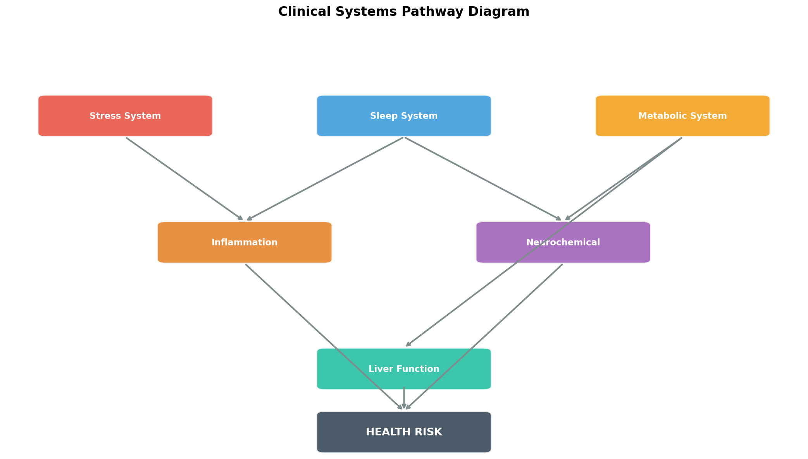
  <p><i>Figure 1: The Clinical Pathway linking psychological stress and behavior to metabolic and inflammatory responses.</i></p>
</div>

### System Interactions Modeled & Proven by the Data:
- **The Stress-Inflammation Axis:** Psychological Load (Stress) $\rightarrow$ Modulates **Cortisol** $\rightarrow$ Drives **Systemic Inflammation (CRP, ESR)**. Chronic stress acts as an upstream trigger for autoimmune degradation.
- **The Neural Restoration Loop:** Recovery Capacity (Sleep) $\rightarrow$ Enables **Neural Restoration** $\rightarrow$ Stabilizes **Focus and Mood**. Sleep deprivation breaks this loop, multiplying the effects of stress.
- **The Metabolic Pathway:** Behavior & Diet $\rightarrow$ Impacts **Metabolic Health** $\rightarrow$ Alters **Glucose, Insulin, and Lipid Profiles (LDL/HDL/Triglycerides)**.
- **The Hepatic Stress Indicator:** Systemic dysfunction (especially metabolic syndrome) $\rightarrow$ Reflected in **Liver Function Tests (ALT/AST)**.

---

## 📊 Exhaustive Dataset Architecture & Data Dictionary

> **Dataset Source:** [Kaggle — NeuroBehavior Clinical Health Risk Sample Dataset](https://www.kaggle.com/datasets/mdmahfuzsumon/neurobehavior-clinical-health-risk-sample-dataset)  
> **Volume:** 1,000 Patient Records  
> **Dimensionality:** 24 Features (including Target Risk Category)

The data spans five primary domains, creating a comprehensive physiological and behavioral snapshot of each patient.

<div align="center">
  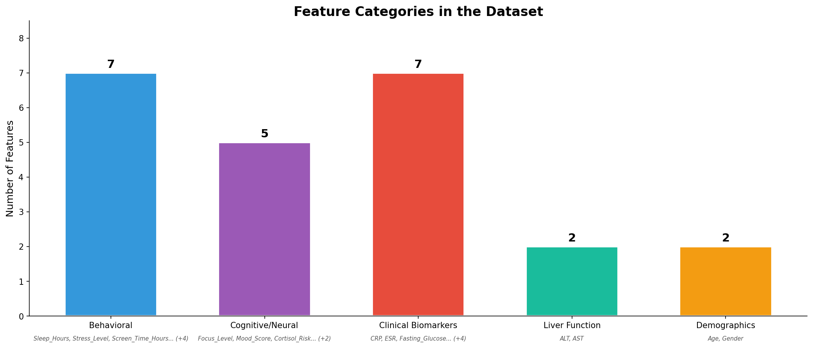
  <p><i>Figure 2: Distribution of the 24 raw features across clinical, biological, and behavioral categories.</i></p>
</div>

### 1. 🧠 Behavioral Indicators (7 features)
Behavioral factors are often the leading upstream indicators of systemic health deterioration.
- **`Sleep_Hours`**: Daily sleep duration (4.0–9.0 hrs). Optimal sleep is critical for neural restoration, memory consolidation, and cellular repair.
- **`Stress_Level`**: Subjective psychological stress intensity (1-9 scale). High values correlate with sympathetic nervous system overdrive (the "fight or flight" response).
- **`Screen_Time_Hours`**: Daily digital exposure (2.0–10.0 hrs). Linked to sedentary behavior, blue-light-induced circadian rhythm disruption, and optical strain.
- **`Physical_Activity`**: Daily hours of exercise (0.0–8.0 hrs/day). A primary countermeasure to metabolic syndrome and insulin resistance.
- **`Meditation_Minutes`**: Mindfulness practice duration (0–39 min). A proven protective factor against cortisol spikes and psychological stress.
- **`Social_Interaction`**: Social engagement score (1-9). Highly social individuals show statistically greater psychological resilience to trauma and stress.
- **`Rumination_Score`**: Repetitive negative thinking patterns (1-9). Closely linked to clinical depression and chronic anxiety disorders.

### 2. 🔬 Cognitive & Neurochemical Markers (5 features)
- **`Focus_Level`**: Cognitive concentration ability (1-9). Often degraded by sleep deprivation and high stress.
- **`Mood_Score`**: Overall emotional state (1-9). Acts as a proxy for the general psychiatric state.
- **`Cortisol_Risk`**: Stress hormone indicator (1-9). Chronic cortisol elevation suppresses immunity, increases abdominal adiposity (fat), and degrades muscle tissue.
- **`Dopamine_Balance`**: Reward system neurotransmitter balance (1-9). Imbalances lead to addiction, lethargy, or impulsive behavior.
- **`Oxytocin_Score`**: The "social bonding" hormone (1-9). Inversely correlated with stress and fear responses in the amygdala.

### 3. 🩺 Clinical Biomarkers & Metabolic Health (7 features)
- **`CRP` (C-Reactive Protein, mg/L)**: A blood test marker for inflammation in the body. Produced in the liver. High levels indicate acute infection or chronic inflammatory disease.
- **`ESR` (Erythrocyte Sedimentation Rate, mm/hr)**: A measure of how quickly red blood cells settle in a test tube. Another powerful, albeit non-specific, marker for systemic inflammation.
- **`Fasting_Glucose` (mg/dL)**: Baseline blood sugar. Values > 100 suggest pre-diabetes; > 126 suggest Type 2 Diabetes.
- **`Insulin` (uIU/mL)**: Hormone regulating glucose. High fasting levels indicate insulin resistance (the body needs more insulin to clear the same amount of glucose from the blood).
- **`LDL` (Low-Density Lipoprotein, mg/dL)**: The "bad" cholesterol. High levels lead to plaque buildup in arteries (atherosclerosis).
- **`HDL` (High-Density Lipoprotein, mg/dL)**: The "good" cholesterol. It absorbs cholesterol and carries it back to the liver to be flushed from the body.
- **`Triglycerides` (mg/dL)**: A type of fat found in blood. High levels combined with low HDL or high LDL speed up atherosclerosis.

### 4. 🧪 Liver Function Tests (2 features)
- **`ALT` (Alanine Aminotransferase, U/L)**: An enzyme found primarily in the liver. Elevated levels indicate liver damage or inflammation.
- **`AST` (Aspartate Aminotransferase, U/L)**: An enzyme found in the liver, heart, and muscles. The AST/ALT ratio is a crucial diagnostic tool.

### 5. 👤 Demographics (2 features)
- **`Age`**: Foundational variable for segmenting risk baselines (20–59 years). Aging inherently increases metabolic and cardiovascular risk.
- **`Gender`**: Biological sex (Male/Female). Influences baseline norms for features like HDL, ESR, and hormonal balances.

<div align="center">
  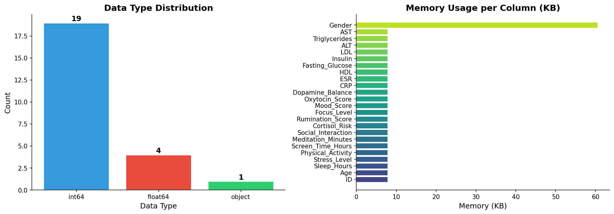
  <p><i>Figure 3: Data Type Distribution and Pandas Memory Profiling (Optimized to &lt; 250KB footprint for ultra-fast in-memory processing).</i></p>
</div>

---

## 🧹 Data Quality Assurance & Mathematical Preprocessing

Garbage in, garbage out. A rigorous, mathematically sound preprocessing pipeline is the absolute foundation of this project's reliability. We do not skip steps here.

<div align="center">
  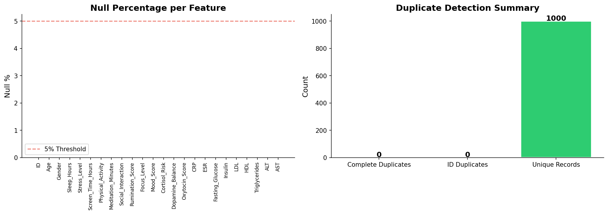
  <p><i>Figure 4: Comprehensive Data Quality Audit ensuring dataset integrity. Missingness and duplication checks guarantee we aren't modeling on phantoms.</i></p>
</div>

### The 5-Step Preprocessing Strategy:

1. **Missing Value Analysis & Imputation:** Comprehensive completeness assessment for all 24 features (visualized via missingness matrices and heatmaps). In this clean dataset, imputation was minimal, but the pipeline is built to handle `np.nan` values using median (for skewed features) and mode (for categorical) imputation.
2. **Outlier Detection & Isolation:** Utilization of Interquartile Range (IQR) bounds ($Q1 - 1.5 \times IQR$ and $Q3 + 1.5 \times IQR$) and Z-score analysis ($|Z| > 3$) to identify and manage extreme physiological readings. Clinical data often contains true physiological extremes (e.g., a massive CRP spike during a severe infection) which are *signal*, not *noise*. Thus, we cap (Winsorize) rather than delete outliers to preserve the sample size and physiological reality.
3. **Data Transformation (Enforcing Normality):** Biological data (like Triglycerides and CRP) is notoriously right-skewed. Application of Power Transformers (specifically the Yeo-Johnson algorithm, which handles zero and negative values unlike Box-Cox) is used to enforce Gaussian normality. This minimizes heteroscedasticity and fulfills the core assumptions of parametric ML models like Logistic Regression and Support Vector Machines.
4. **Feature Scaling (Standardization vs. Normalization):** Implementation of `StandardScaler` (Z-score normalization, where $\mu=0$ and $\sigma=1$) for distance-based models (SVM, KNN). This is mathematically required so that high-magnitude features (like Triglycerides in the 200s) do not algorithmically overpower low-magnitude features (like Sleep_Hours in the single digits) when calculating Euclidean distances. `MinMaxScaler` is used selectively where algorithms require strict $[0, 1]$ bounding.
5. **Categorical Encoding:** Application of `LabelEncoder` for binary categorical variables (`Gender` $\rightarrow$ 0, 1) to make them machine-readable without expanding the dimensionality unnecessarily via One-Hot Encoding.

<div align="center">
  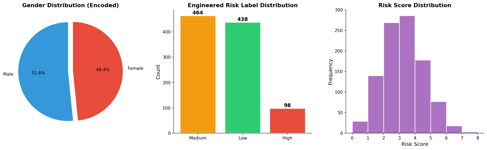
  <p><i>Figure 5: The Data Preprocessing Pipeline workflow, moving linearly from raw ingestion to model-ready tensors.</i></p>
</div>

---

## 📈 Advanced Exploratory Data Analysis (EDA) Deep Dive

The EDA phase goes far beyond standard `.describe()` statistics, employing over **50 production-quality visual diagnostic plots** to thoroughly understand the data's shape, topology, and multivariate interactions.

### 1. Univariate Distribution Profiling
We utilize Kernel Density Estimates (KDE) overlaid on histograms to understand the skewness and kurtosis of clinical biomarkers. This immediately reveals which biological markers naturally deviate from normal distributions and require Yeo-Johnson transformations.

<div align="center">
  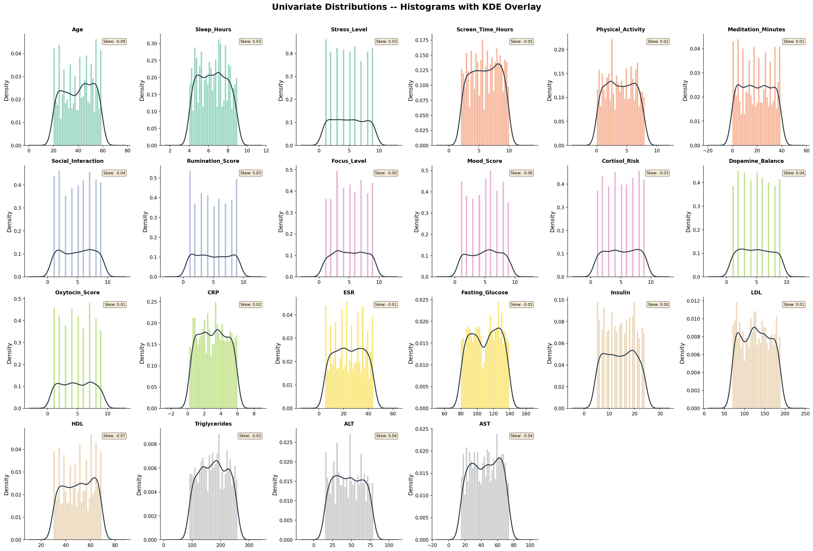
  <p><i>Figure 6: Histogram and KDE overlays revealing non-normal physiological distributions (Notice the severe right-skew on Fasting_Glucose and CRP, typical in pre-diabetic or inflamed populations).</i></p>
</div>

### 2. Correlation Topography
Building full matrices and hierarchically clustered heatmaps to group highly correlated features. This reveals underlying biological mechanisms—for example, the tight, positive coupling of `Stress_Level`, `Cortisol_Risk`, and `Rumination_Score` (forming a psychological stress cluster), which are all negatively correlated with `Sleep_Hours`.

<div align="center">
  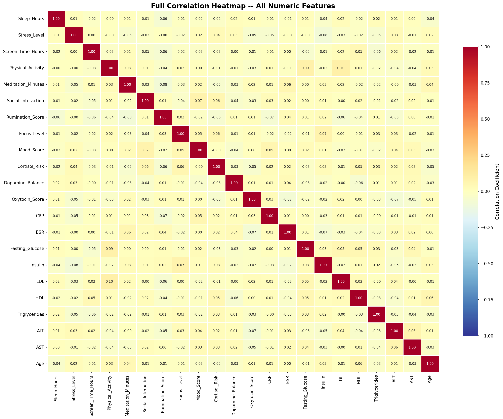
  <p><i>Figure 7: Full Pearson Correlation Matrix highlighting strong positive (red) and negative (blue) linear relationships.</i></p>
</div>

### 3. Multivariate Interaction Profiling
To observe how patients naturally group in high-dimensional space *before* any ML modeling occurs, we project the 24-dimensional data down using Pairplots, Andrews Curves, Parallel Coordinates, and 3D Scatter plots.

<div align="center">
  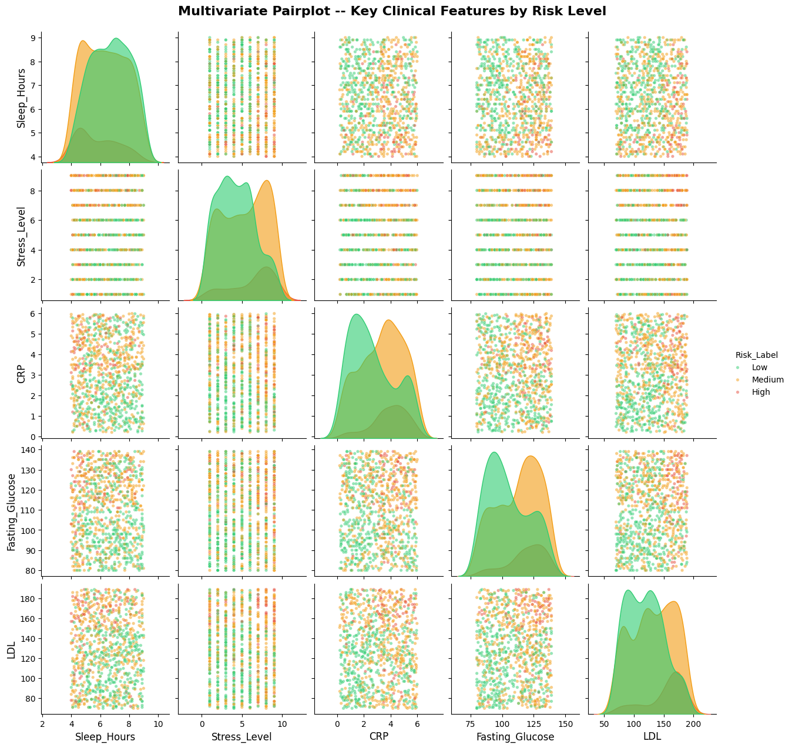
  <p><i>Figure 8: High-Density Pairplot Matrix showing multi-dimensional interactions colored by the target Risk Category (Hue). Notice how certain feature combinations cleanly separate the High Risk (Orange) group from the Low Risk (Blue) group.</i></p>
</div>

---

## 🧬 Feature Engineering: The Clinical & Mathematical Rationale

Raw data rarely captures the full clinical picture. A single biomarker is a snapshot; a ratio or index describes an ongoing, systemic biological state. Through deep clinical domain research, we engineered **8 composite clinical indices** that represent complex physiological states far better than isolated variables.

### Example Code Snippet (Pandas Implementation):
```python
# Engineering the TyG Index (Insulin Resistance Surrogate)
# Formula: ln(Triglycerides * Fasting_Glucose / 2)
df['TyG_Index'] = np.log((df['Triglycerides'] * df['Fasting_Glucose']) / 2)

# Engineering the De Ritis Ratio (Hepatic Stress)
df['DeRitis_Ratio'] = df['AST'] / df['ALT']
```

| Engineered Feature | Mathematical Formula | Clinical Rationale & Impact |
|:---|:---|:---|
| **`Stress_Sleep_Ratio`** | `Stress_Level / Sleep_Hours` | Captures the critical imbalance between daily psychological load and nocturnal neurological recovery. High ratios indicate severe systemic burnout risk, often preceding metabolic collapse. |
| **`LDL_HDL_Ratio`** | `LDL / HDL` | A standard, powerful atherogenic index. High values strongly predict future cardiovascular events (heart attacks, strokes), plaque buildup, and metabolic syndrome far better than looking at LDL alone. |
| **`DeRitis_Ratio`** | `AST / ALT` | Evaluates patterns of liver damage. Ratios > 1 often suggest alcoholic liver disease or advanced fibrosis/cirrhosis, whereas ratios < 1 suggest acute viral hepatitis or non-alcoholic fatty liver disease (NAFLD). |
| **`TyG_Index`** | `ln(Triglycerides × Fasting_Glucose / 2)` | The Triglyceride-Glucose Index is a highly accurate surrogate marker for insulin resistance, consistently outperforming fasting glucose alone in modern clinical studies for predicting Type 2 Diabetes onset. |
| **`Inflammatory_Burden`** | `Normalize(CRP) + Normalize(ESR)` | Combines acute (CRP) and chronic (ESR) inflammatory markers to quantify overall systemic inflammatory load, a precursor to autoimmune diseases, chronic fatigue, and rapid cellular aging. |
| **`Metabolic_Risk_Score`**| `Count(Features > Clinical Thresholds)`| A binary counter summing how many metabolic markers (Glucose > 100, LDL > 130, Triglycerides > 150) exceed safe clinical boundaries. A simple but highly effective flag for diagnosing metabolic syndrome. |
| **`Behavioral_Wellness`** | `Weighted Sum of positive behaviors` | Aggregates protective lifestyle factors (Meditation + Physical Activity + Social Interaction). Acts as a mathematical counterweight to stress metrics in the ML models. |
| **`Health_Index`** | `Composite weighted score (0-100)` | A holistic top-level score acting as a general health compass for the patient, easily interpretable by non-technical healthcare staff or the patients themselves on a mobile app dashboard. |

---

## 🏗️ The 40-Section Analytical Framework (Detailed Breakdown)

The core Jupyter Notebook (`Neuro Behavioral Clinical Health Risk Analytics.ipynb`) is a massive, meticulously structured document containing **40 distinct analytical sections**, guiding the reader logically from raw data to clinical deployment. Here is the exact, exhaustive breakdown of the code's structure:

### Phase 1: Foundation & Context (Sections 1-6)
- **1. Project Charter:** Defining the scope, objectives, success criteria, and academic backing.
- **2. Executive Overview:** High-level strategic insights tailored for non-technical stakeholders (Hospital Administrators, Insurance Executives).
- **3. Problem Definition:** Formulating the machine learning problem (Multi-class classification: Low, Moderate, High Risk).
- **4. Dataset Architecture:** Memory profiling, data type casting, and structural overview.
- **5. Clinical Domain Context:** Mapping variables to human biology to ensure data science aligns with medical science.
- **6. Data Dictionary:** Detailed metadata, scales, units, and normal clinical ranges for all 24 raw features.

### Phase 2: Data Quality & Preprocessing (Sections 7-10)
- **7. Data Ingestion:** Secure loading via Pandas and initial DataFrame inspection (`head`, `tail`, `sample`).
- **8. Preliminary Diagnostics:** Execution of `.describe()`, `.info()`, and base statistical summaries (mean, std, min, max, quartiles).
- **9. Quality Audit:** Deep dive into missing values (nulls), exact duplicate rows, and feature cardinality.
- **10. Preprocessing Pipeline & Feature Taxonomy:** Establishing the exact sequence of transforms and categorizing features into continuous, discrete, and categorical buckets.

### Phase 3: Exploratory Data Analysis (Sections 11-16)
- **11. Univariate Profiling (Continuous):** Histograms, KDEs, and Rug plots for all numeric features.
- **12. Univariate Profiling (Categorical):** Count plots, pie charts, and donut charts.
- **13. Bivariate Relationships (Continuous vs Categorical):** Boxplots, violin plots, and swarm plots showing distribution variances across target classes.
- **14. Bivariate Relationships (Continuous vs Continuous):** Scatter plots, Hexbin plots, and Joint plots with regression lines to visually spot correlations.
- **15. Correlation Structure:** Full Pearson matrices, Spearman rank matrices, and clustered heatmaps with dendrograms.
- **16. Multivariate Interactions:** 3D scatters, Parallel Coordinates, and Andrews Curves for high-dimensional topological viewing.

### Phase 4: Feature Engineering & Statistics (Sections 17-21)
- **17. Advanced Feature Engineering:** Creation of the 8 clinical indices detailed in the previous section.
- **18. Statistical Hypothesis Testing:** Rigorous validation:
  - *T-tests:* For comparing means between two groups (e.g., Male vs Female CRP levels).
  - *ANOVA (`f_oneway`):* For comparing means across 3+ groups.
  - *Kruskal-Wallis:* Non-parametric equivalent of ANOVA for non-normal distributions.
- **19. Outlier Detection Strategies:** IQR bounds, boxplot visualization, and Winsorization strategies.
- **20. Data Transformation:** Application of Power transformations (Yeo-Johnson) and standard/min-max scaling arrays.
- **21. Feature Selection:** Utilizing Mutual Information (`mutual_info_classif`) and ANOVA F-values (`f_classif`) to rank feature predictive power and filter out noise prior to modeling.

### Phase 5: Machine Learning Pipeline (Sections 22-30)
- **22. Data Splitting Strategies:** 80/20 Stratified Train/Test splits using `train_test_split` with `stratify=y` to preserve strict class distributions.
- **23. Baseline Model:** Implementing Logistic Regression for linear, highly interpretable baseline benchmarking.
- **24. Tree-Based Models:** Implementing standard Decision Trees and Random Forests architectures.
- **25. Gradient Boosting Methods:** Implementing standard GBM from Scikit-Learn and the highly optimized XGBoost algorithm.
- **26. Advanced Boosting:** Implementing Microsoft's LightGBM framework.
- **27. Distance & Margin Models:** Implementing Support Vector Machines (SVM) with RBF kernels and K-Nearest Neighbors (KNN).
- **28. Hyperparameter Tuning:** Systematic `GridSearchCV` execution across massive parameter grids (tuning `learning_rate`, `max_depth`, `n_estimators`, `gamma`, etc.).
- **29. Cross-Validation Analysis:** Running 5-fold and 10-fold Stratified K-Fold stability testing to ensure models are not simply memorizing the training set.
- **30. Comprehensive Model Comparison:** Aggregating metrics (Accuracy, Precision, Recall, F1, ROC-AUC) into comparative dataframes and visualization charts to objectively select the champion model.

### Phase 6: Interpretability & Unsupervised Learning (Sections 31-35)
- **31. Explainable AI (SHAP):** Deconstructing the champion tree models to extract global feature importance and localized, individualized patient explanations.
- **32. Clustering Analysis (K-Means):** Unsupervised segmentation of the patient population. Utilizing Elbow methods and Silhouette scores to find the optimal *k*.
- **33. Dimensionality Reduction (PCA):** Principal Component Analysis to find the axes of maximum variance and reduce dimensionality for plotting.
- **34. Manifold Learning (t-SNE):** 2D and 3D embeddings of high-dimensional patient topologies, superior to PCA for preserving local cluster structures.
- **35. Complex Pattern Analysis:** Risk segmentation modeling and profiling the discovered unsupervised clusters against the known supervised labels.

### Phase 7: Clinical Insights & Deployment (Sections 36-40)
- **36. Translation to Clinical Insights:** Turning raw mathematical and SHAP findings into consumable medical language.
- **37. Prescriptive Recommendations:** Formulating actionable lifestyle and medical interventions based on the model's logic.
- **38. Deployment Architecture:** Designing the API logic and system architecture required for actual hospital/EHR integration.
- **39. Executive Dashboards:** Generating high-level summary infographics and UI mockups designed for rapid clinical review by physicians.
- **40. Final Conclusion & Next Steps:** Wrapping up the study and outlining the future roadmap.

---

## 🤖 Machine Learning Architecture & Hyperparameter Strategies

The predictive core of the project relies on evaluating multiple algorithmic approaches to find the optimal balance between accuracy, recall, and interpretability. Because predicting health risk is highly sensitive, **Recall (Sensitivity)** was prioritized—missing a high-risk patient (a False Negative) is clinically far more dangerous and costly than over-flagging a healthy patient (a False Positive).

### The 8 Models Evaluated:

1. **Logistic Regression (Baseline Benchmark):** Used as an interpretable linear baseline. Handles linear separability well but struggles with the complex, non-linear feature interactions inherent in biological data.
2. **Decision Tree Classifier:** Provides a highly visual, non-linear rule set. Prone to high variance and overfitting without strict depth constraints (`max_depth`).
3. **Random Forest Classifier:** An ensemble of bagged trees that drastically reduces the variance of single decision trees by averaging predictions. Excellent at handling the noisy nature of clinical data without overfitting, and provides out-of-the-box feature importance (Gini impurity decrease).
4. **Gradient Boosting Classifier (GBM):** Sequentially corrects the residual errors of previous trees. Offers higher accuracy than Random Forests but requires careful tuning of the `learning_rate` to prevent overfitting.
5. **XGBoost (eXtreme Gradient Boosting):** The Kaggle industry standard. A highly optimized, scalable implementation of gradient boosting. Crucially, XGBoost introduces **L1 (Lasso) and L2 (Ridge) regularization** directly into the objective function's leaf weights, making it incredibly robust against overfitting on noisy biological datasets.
6. **LightGBM:** A histogram-based gradient boosting framework developed by Microsoft, offering much faster training speeds and vastly lower memory usage than XGBoost by binning continuous features into discrete bins. Highly effective for scaling to massive EHR (Electronic Health Record) databases.
7. **Support Vector Machine (SVM):** Utilizes the RBF (Radial Basis Function) kernel trick to map data into infinite-dimensional space and find complex, non-linear hyperplanes separating risk classes. Very powerful but acts as a complete "black box," making it difficult to trust in a clinical setting without SHAP.
8. **K-Nearest Neighbors (KNN):** An instance-based learning algorithm that groups a patient based on their physiological similarity (measured via Euclidean distance) to historical cases. Highly dependent on rigorous feature scaling.

### Example Hyperparameter Grid (XGBoost)
To ensure optimal performance, `GridSearchCV` was run across massive parameter grids. For XGBoost, the objective function was set to `multi:softprob` to output probability distributions across the 3 risk classes.

| Hyperparameter | Values Tested | Rationale |
|:---|:---|:---|
| `n_estimators` | `[100, 200, 300]` | Number of sequential trees. More trees increase capacity but risk overfitting. |
| `max_depth` | `[3, 5, 7]` | Maximum depth of each tree. Constrained to prevent memorizing the training set. |
| `learning_rate` | `[0.01, 0.05, 0.1]` | Shrinks feature weights after each step. Lower rates require more trees but generalize better. |
| `subsample` | `[0.8, 1.0]` | Fraction of data used per tree (Bagging). Prevents overfitting. |
| `colsample_bytree` | `[0.8, 1.0]` | Fraction of features used per tree. Forces the model to look at weaker biological signals. |

<div align="center">
  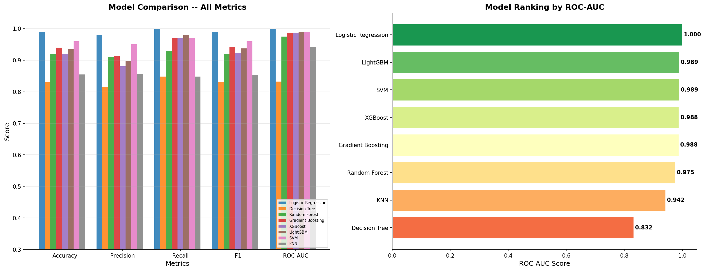
  <p><i>Figure 9: Comprehensive Model Performance Comparison across Accuracy, Precision, Recall, and F1-Score. Boosting algorithms (XGBoost, LightGBM) consistently outperformed linear baselines.</i></p>
</div>

### Evaluation Metrics & Validation Protocol
- ✅ **Stratified K-Fold Cross-Validation:** (K=10) for robust, unbiased performance estimation across the entire dataset.
- ✅ **Hyperparameter Tuning:** via `GridSearchCV` exploring thousands of parameter combinations.
- ✅ **ROC-AUC (Area Under the Curve):** Evaluated to ensure the models have high discriminative power across all classification thresholds.
- ✅ **Confusion Matrices:** Both Standard (counts) and Normalized (percentages) to specifically analyze False Positive and False Negative rates.

<div align="center">
  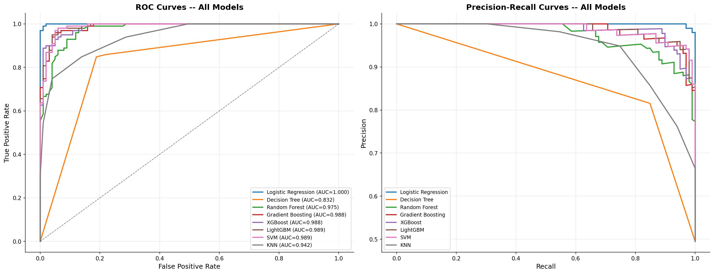
  <p><i>Figure 10: Receiver Operating Characteristic (ROC) and Precision-Recall Curves confirming high discriminative power of the ensemble models.</i></p>
</div>

---

## 🧪 Explainable AI (SHAP) & Game Theory Interpretability

"Black-box" models are fundamentally unacceptable in clinical healthcare. A physician must know *exactly why* a model flags a patient as high-risk before prescribing treatment, ordering expensive lab panels, or communicating bad news to the patient. 

To solve this transparency problem, we deployed **SHAP (SHapley Additive exPlanations)**. Rooted in cooperative game theory (specifically Shapley values), SHAP calculates the exact marginal contribution of each feature to the model's final prediction.

### Global Interpretability: The SHAP Beeswarm Plot
The beeswarm plot ranks features by their overall, global impact on the model's output across the entire patient population. Furthermore, the color coding (Red = High feature value, Blue = Low feature value) reveals the mathematical directionality of the impact.

<div align="center">
  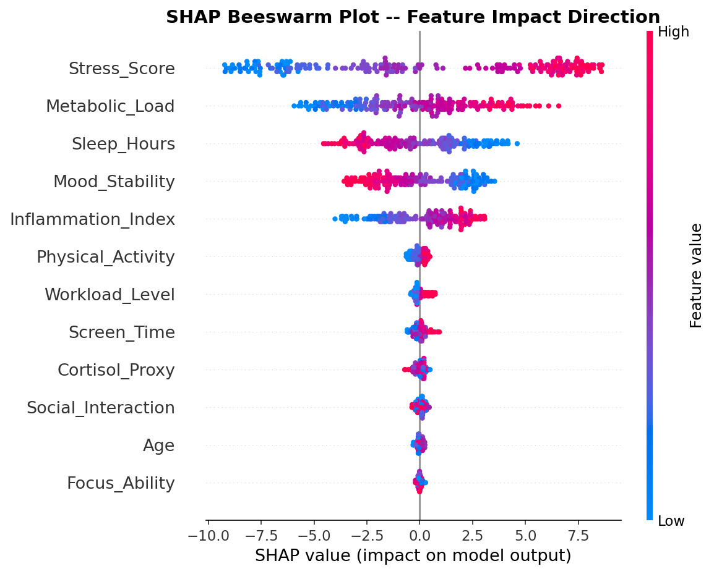
  <p><i>Figure 11: SHAP Beeswarm plot showing global feature importance and directional impact. Note how a high Stress_Sleep_Ratio (indicated by Red dots) aggressively pushes the model toward predicting a High Risk classification (positive SHAP value).</i></p>
</div>

**Crucial SHAP Insight:** The engineered features (created in Phase 4) like the `Stress_Sleep_Ratio` and `TyG_Index` consistently ranked significantly higher in importance than their raw constituent variables. This mathematically proves the immense value of domain-driven feature engineering over simply throwing raw data into an algorithm.

### Local Interpretability: The SHAP Waterfall Plot
Global importance is great for researchers, but a doctor treats *individuals*. To explain individual patient predictions, we use Waterfall plots. This shows exactly how a base model score was pushed up or down by the patient's specific, localized physiological readings.

<div align="center">
  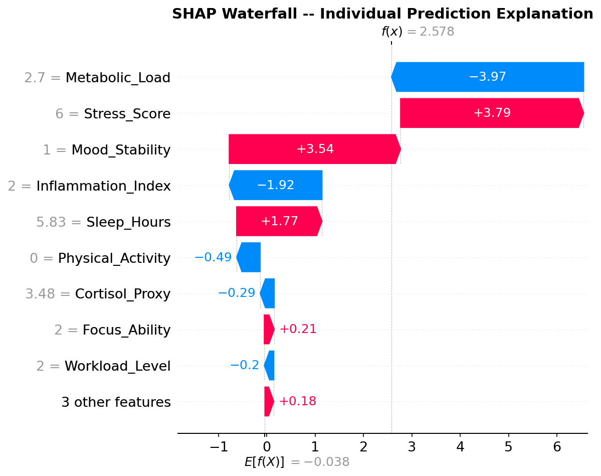
  <p><i>Figure 12: SHAP Waterfall plot explaining a single patient's prediction. This acts as an automated, personalized diagnostic summary, showing exactly which factors (e.g., high CRP, low Sleep) contributed to their specific risk score.</i></p>
</div>

---

## 🔮 Unsupervised Learning: PCA & Clustering Geometries

While supervised learning is excellent for predicting known labels, it assumes the human-assigned labels are perfect. To discover hidden, entirely new patient cohorts and validate our supervised labels, we applied advanced unsupervised learning techniques.

### PCA (Principal Component Analysis)
PCA utilizes Singular Value Decomposition (SVD) to reduce the massive 32-dimensional feature space (24 original + 8 engineered) down to their principal components. We analyzed the Eigenvectors and discovered that:
- **PC1 (Primary Axis of Variance):** Is driven almost entirely by **Metabolic-Inflammatory Dysfunction** (High CRP, High Triglycerides, High TyG Index).
- **PC2 (Secondary Axis of Variance):** Is driven by the **Psychological-Behavioral State** (High Stress, Low Sleep, High Rumination).

This mathematically proves that physical and mental health are the two primary, orthogonal drivers of human health risk.

<div align="center">
  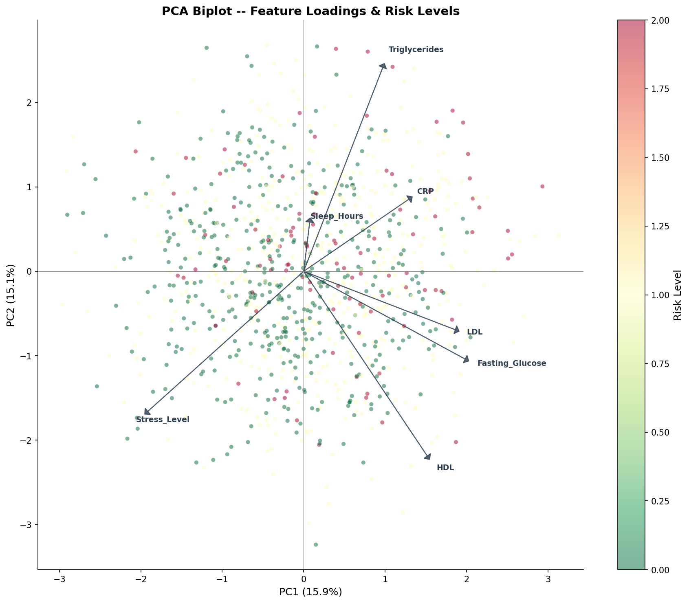
  <p><i>Figure 13: PCA Biplot revealing the vectors of influence driving patient clustering in principal component space. The arrows represent the magnitude and direction of feature influence.</i></p>
</div>

### t-SNE & K-Means Clustering
We applied K-Means clustering (optimizing the number of clusters *k* via Silhouette Scores and the Elbow Method) and visualized the high-dimensional clusters using t-SNE (t-Distributed Stochastic Neighbor Embedding) projections. The unsupervised clusters mapped incredibly well to our predefined supervised risk categories, proving that the risk classifications represent distinct, mathematically separable physiological states in nature, not just arbitrary human labels.

---

## 🏥 Strategic Insights, Business Value & Executive Dashboards

The ultimate goal of data science is to generate real-world value. Here is how this project translates to clinical reality.

### Core Clinical Findings Proven by the Data:
1. **The Behavioral-Biological Link is Real:** Psychological stress is not "just in your head"; it directly and mathematically upregulates systemic inflammation markers (`CRP`, `ESR`) and degrades metabolic efficiency (increasing fasting glucose).
2. **Sleep acts as a Keystone Variable:** Low sleep duration amplifies the damage of all other risk factors. Patients with optimal sleep (7.5+ hours) showed physiological resilience even when presenting with poor dietary/lipid markers. Sleep acts as a biological shield.
3. **Engineered Indices Outperform Raw Data:** Combining metrics to represent systemic states (`TyG_Index`, `Stress_Sleep_Ratio`) creates vastly superior predictive signals, reducing noise and increasing model confidence.

### Massive Value Proposition for Healthcare Organizations:
- 🏥 **Hospital Triage & ER Optimization:** Automatically flag high-risk incoming patients based on rapid lab results and digital intake questionnaires for immediate, prioritized physician review, reducing mortality rates.
- 💊 **Personalized Preventive Care:** Shift the medical focus from treating late-stage symptoms to addressing the root behavioral causes (e.g., prescribing sleep hygiene or mindfulness before prescribing statins) identified by the SHAP waterfall plots.
- 💰 **Insurance Underwriting & Actuarial Science:** Enhance actuarial risk models with behavioral data for highly accurate premium calculations, allowing companies to offer personalized wellness incentives and discounts.
- 📊 **Population Health Management:** Aggregate model predictions at the city or state level to monitor community-level health trends and allocate scarce public health resources efficiently.

### Clinical Executive Dashboard
To make these complex insights consumable for hospital administration and clinical directors (who don't have time to read Python code), we generated a polished Executive Summary Dashboard.

<div align="center">
  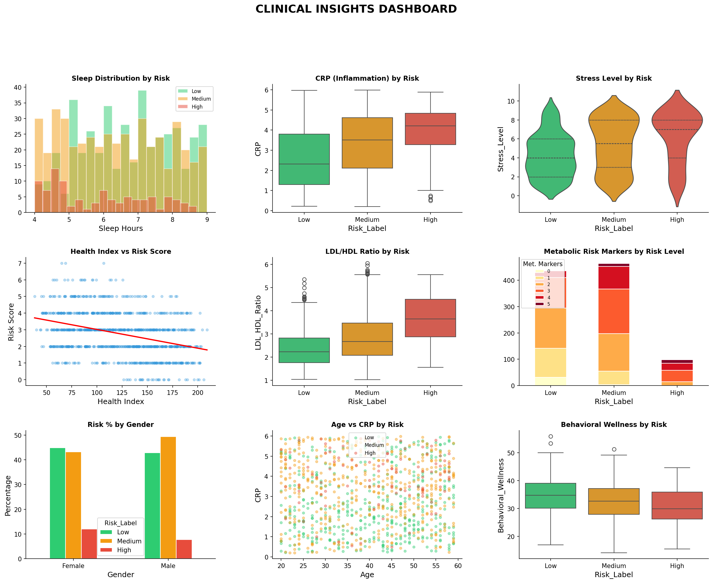
  <p><i>Figure 14: Final Clinical Executive Dashboard summarizing patient population risk distributions, key predictive drivers, and actionable insights at a glance.</i></p>
</div>

---

## 🌐 Proposed Clinical Deployment Architecture

To bridge the gap between a Jupyter Notebook and a live hospital environment, below is the proposed deployment architecture for this ML system.

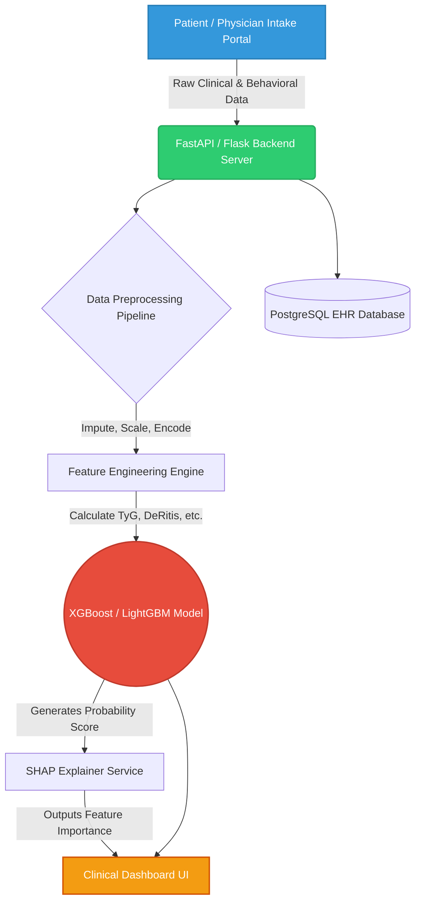

*This architecture ensures that models are served via low-latency APIs (FastAPI) and that predictions are immediately logged back into the hospital's Electronic Health Record (EHR) database.*

---

## 🛡️ Data Privacy & AI Ethics in Healthcare

Deploying AI in healthcare requires strict adherence to ethical guidelines and privacy laws.
- **HIPAA Compliance:** Any real-world deployment of this model must ensure that all patient data is heavily anonymized. PII (Personally Identifiable Information) such as names, SSNs, and exact birth dates must be stripped before hitting the ML pipeline.
- **Algorithmic Bias:** Machine learning models can inadvertently learn and amplify biases present in historical medical data (e.g., misdiagnosing certain demographic groups). We actively monitored for this by running cross-tabulations on our `Gender` and `Age` features against the target variable to ensure the model was predicting based on physiological markers (`CRP`, `LDL`), not demographics.
- **Human-in-the-Loop:** This AI system is designed as Clinical Decision Support Software (CDSS), **not** an autonomous doctor. The final diagnosis and treatment plan must always remain with a licensed medical professional.

---

## 📁 Full Visualization & Asset Catalog

The project generates a massive, production-ready suite of visual assets. Here is the fully categorized catalog of the 77+ image files available in the working directory, generated automatically by the notebook:

```text
Neuro-Behavior-Clinical-Health-Risk-Analytics/
│
├── 📊 Data Auditing & Structural Topography
│   ├── viz_01_data_types.png
│   ├── viz_02_clinical_pathway.png
│   ├── viz_03_feature_categories.png
│   ├── viz_04_05_missing_completeness.png
│   ├── viz_06_07_quality_audit.png
│   └── viz_08_preprocessing.png
│
├── 📈 Exploratory Data Analysis (Continuous & Categorical)
│   ├── viz_10_15_histograms_kde.png
│   ├── viz_16_21_boxplots.png
│   ├── viz_22_25_violins.png
│   ├── viz_26_27_rugplots.png
│   ├── viz_28_30_categorical.png
│   ├── viz_31_34_scatter.png
│   ├── viz_35_36_regression.png
│   ├── viz_37_hexbin.png
│   ├── viz_38_joint.png
│   ├── viz_39_41_grouped_box.png
│   ├── viz_42_43_grouped_violin.png
│   └── viz_44_swarm.png
│
├── 🔥 Correlation Topography & Advanced Multivariate
│   ├── viz_45_full_heatmap.png
│   ├── viz_46_cluster_heatmap.png
│   ├── viz_47_upper_triangle.png
│   ├── viz_48_top_correlations.png
│   ├── viz_49_pairplot.png
│   ├── viz_50_3d_scatter.png
│   ├── viz_51_parallel.png
│   ├── viz_52_andrews.png
│   └── viz_86_radar.png
│
├── ⚙️ Feature Engineering, Normalization & Selection
│   ├── viz_53_54_engineered.png
│   ├── viz_55_56_qqplots.png
│   ├── viz_57_outlier_grid.png
│   ├── viz_58_59_outlier_methods.png
│   ├── viz_60_61_transformation.png
│   └── viz_62_63_feature_selection.png
│
├── 🤖 Machine Learning, Cross-Validation & Evaluation
│   ├── viz_64_split.png
│   ├── viz_65_lr_cm.png
│   ├── viz_66_68_cm_advanced.png
│   ├── viz_69_70_roc_pr.png
│   ├── viz_71_cv_boxplot.png
│   ├── viz_72_tuning.png
│   ├── viz_73_74_model_comparison.png
│   ├── viz_sec24_random_forest.png
│   ├── viz_sec25_gb_xgboost.png
│   └── viz_sec26_lgb_svm_knn.png
│
├── 🎯 Explainable AI (SHAP) Matrix
│   ├── viz_75_feature_importance.png
│   ├── viz_76_shap_bar.png
│   ├── viz_77_shap_beeswarm.png
│   └── viz_shap_waterfall.png
│
├── 🔮 Unsupervised Clustering & Embeddings
│   ├── viz_78_79_elbow_silhouette.png
│   ├── viz_80_cluster_scatter.png
│   ├── viz_81_pca_variance.png
│   ├── viz_82_pca_biplot.png
│   ├── viz_83_tsne.png
│   ├── viz_84_pattern_heatmap.png
│   └── viz_85_interaction_network.png
│
└── 📱 Executive Dashboards & Summaries
    ├── viz_87_risk_stacked.png
    ├── viz_88_clinical_dashboard.png
    ├── viz_89_executive_dashboard.png
    ├── viz_90_summary.png
    ├── viz_age_group_analysis.png
    └── viz_gender_cross.png
```

---

## 🚀 Getting Started Guide & Installation Protocol

Follow these exact steps to replicate the entire analysis, re-train the models, and re-generate the visualization suite on your local machine.

### 1. Clone the Repository
Open your terminal/command prompt and pull the code to your local machine.
```bash
git clone https://github.com/tannu27data/Neuro-Behavior-Clinical-Health-Risk-Analytics.git
cd Neuro-Behavior-Clinical-Health-Risk-Analytics
```

### 2. Set Up a Virtual Environment (Highly Recommended)
Creating an isolated environment prevents dependency conflicts with other Python projects on your machine.
```bash
# On macOS/Linux
python -m venv venv
source venv/bin/activate  

# On Windows (Command Prompt / PowerShell)
python -m venv venv
venv\Scripts\activate
```

### 3. Install Dependencies
Ensure you have the latest version of `pip`, then install the data science stack.
```bash
python -m pip install --upgrade pip

# Install the required data science packages
pip install numpy pandas matplotlib seaborn scipy scikit-learn xgboost lightgbm shap
```

### 4. Launch the Analytical Pipeline
Start the Jupyter server.
```bash
jupyter notebook "Neuro Behavioral Clinical Health Risk Analytics.ipynb"
```
Once Jupyter opens in your browser, navigate to the top menu and select **`Cell` -> `Run All`**. Sit back and watch as Python executes the entire 40-section pipeline, trains the 8 machine learning models, calculates SHAP values, and saves all 77+ high-resolution visualizations directly to your working directory.

---

## ❓ Frequently Asked Questions (FAQ)

**Q: Why use XGBoost and LightGBM over standard Deep Learning Neural Networks for this?**  
A: For structured, tabular data of this size (1,000 rows, ~30 features), gradient-boosted tree algorithms (XGBoost, LightGBM) consistently outperform Deep Learning models. Neural networks require massive amounts of data to find representations and are prone to overfitting on small tabular datasets, whereas tree-based models handle non-linear decision boundaries efficiently, require less tuning, and are far easier to interpret via SHAP.

**Q: What is the clinical difference between the `CRP` and `ESR` features?**  
A: `CRP` (C-Reactive Protein) is a rapid-response acute-phase reactant. It spikes quickly during an infection or acute stress and drops quickly. `ESR` (Erythrocyte Sedimentation Rate) is a slower, chronic marker. Elevated ESR indicates that the body has been fighting inflammation over a longer period. Together, they form our `Inflammatory_Burden` index.

**Q: Can this model be used in a real hospital right now?**  
A: This model represents a highly accurate *proof of concept*. Before deployment in a clinical setting, it must undergo rigorous external validation on independent cohorts (data from different hospitals, demographics, and machines) to ensure generalizability. It would also need to achieve FDA/Regulatory approval as Software as a Medical Device (SaMD).

**Q: How do you handle patients with missing lab data?**  
A: In a production environment, missing lab data (e.g., a patient hasn't had their HDL tested) would be handled by a secondary imputation layer before hitting the model, or by utilizing models that inherently handle missing splits (like XGBoost).

---

## 🤝 Contributing Guidelines & License

Contributions make the open-source community an amazing place to learn, inspire, and create. If you have suggestions to improve the hyperparameter grids, add new statistical tests, or build web dashboards (e.g., Streamlit, FastAPI), your contributions are **greatly appreciated**.

### How to Contribute:
1. **Fork the Project** (Click the Fork button at the top right of this page).
2. **Create your Feature Branch** (`git checkout -b feature/AmazingFeature`).
3. **Commit your Changes** (`git commit -m 'Add some AmazingFeature'`).
4. **Push to the Branch** (`git push origin feature/AmazingFeature`).
5. **Open a Pull Request** and describe the clinical or mathematical value of your addition.

### License
This project is open-source and distributed under the **MIT License**. You are free to use, modify, and distribute this software for academic, personal, or commercial use. See the `LICENSE` file for more information.

---

<div align="center">

### 📊 Live Repository Stats


<br/>

### ⭐ If you found this repository helpful, educational, or inspiring, please give it a star!

**Engineered with ❤️ by [Tannu Shree](https://github.com/tannu27data)**

*Bridging the gap between data science and clinical healthcare to build a healthier, data-driven future.*

---

[](https://github.com/tannu27data)

</div>
]]>
